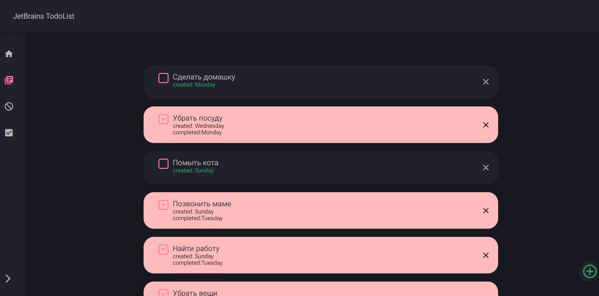
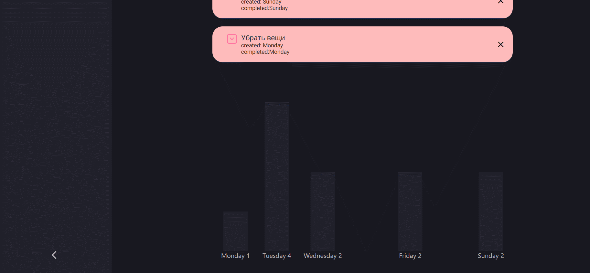

# JetBrains Intrernship TodoList
# В работе использовались:
- React/Redux
- TypeScript
- Styled components

Макет - https://www.figma.com/file/KS2tritFEXoCKzfkY9vJ6t/Untitled?node-id=0%3A1

Фавикон - https://www.favicon.by/

# Функционал:
- Добавление/Удаление задач (валидация при помощи React Hook)

- Интерактивное отображение выполненных задач по дням недели

- Работа с JSON и LocalStorage
- Hеализованы отдельные вкладки для активных и выполненных задач соответственно

# Демо
https://sabfes.github.io/JetBrains-Internship/
# Установка
Перед началом работы необходимо проверить наличие установленного node.js и npm
Скопируйте проект на компьютер:
```
git clone https://github.com/Sabfes/JetBrains-Internship.git
```
Установите зависимости:
```
npm install
```

# Работа

Для локальной разработки с поднятием сервера используйте:

```
npm start
```

Для сборки версии в продакшн:

```
npm run build
```
